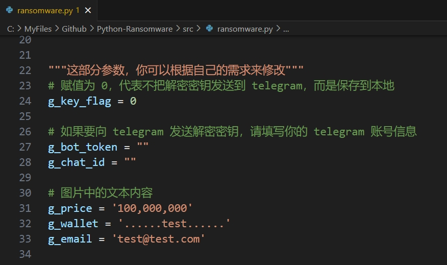

# Python-Ransomware

> [!CAUTION]
>
> **本实验有风险！！！**
>
> **请一定在虚拟机上执行，而且要关闭虚拟机的文件共享！**

## Intro

**About:** This is a Classic Example Of Ransomware Written in python.

**Tested On:** Windows 10 / Windows 7

**Suport :** Windows 7+

## Use

## Package py files into exe files

`pip install pyinstaller`

`pyinstaller --onefile -w --icon YourIcon.ico ./ransomware.py` 

> `--onefile`：将所有的程序文件和依赖打包成一个单独的 exe 文件
>
> `--windowed` 或 `-w`：当运行 exe 文件时，隐藏命令行窗口
>
> `--icon YourIcon.ico`：指定一个图标 YourIcon.ico 用于你的 exe 文件

`pyinstaller --onefile --hidden-import _cffi_backend ./de_ransomware.py` 

> `--hidden-import _cffi_backend`：显式地告诉 PyInstaller 去包含 _cffi_backend 模块
>
> `--console` ：当运行 exe 文件时，会显示一个命令行窗口（这个选项是默认的，可以省略）

## NOTE

THIS SOURCE CODE IS For Educational Purposes Only. 

IM NOT RESBONBLE FOR ANY BAD & MALICIOUS USE OF IT.
